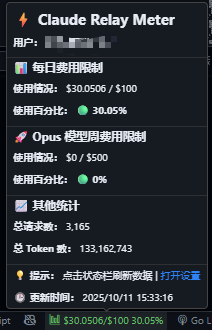
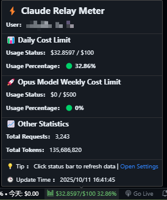

# Claude Relay Meter

[中文](#中文) | [English](#english)

---

## 中文

### 简介

Claude Relay Meter 是一个用于监测 Claude Relay Service 中继服务用量的 VSCode 插件。它可以在 VSCode 状态栏实时显示您的 API 使用情况，包括每日费用、总费用和 Opus 模型周费用等详细信息。

### 运行效果



*图：插件在 VSCode 状态栏中的显示效果*

### 功能特性

- ✅ **实时监控**：自动获取并显示 API 使用情况
- 📊 **状态栏显示**：在状态栏显示当前费用使用情况
- 🌐 **多语言支持**：支持中文和英文界面，可随时切换
- 🎨 **智能颜色提示**：根据使用百分比自动变化颜色
  - 绿色：使用率 < 50%
  - 黄色：使用率 50% - 80%
  - 红色：使用率 > 80%
- 🔍 **详细信息悬停**：鼠标悬停显示完整的费用详情
- ⚙️ **灵活配置**：支持自定义 API 地址、刷新间隔、颜色等
- 🔄 **自动重试**：API 请求失败时自动重试（指数退避）
- 🔑 **API Key 支持**：支持使用 API Key 自动转换为 API ID

### 安装

#### 方法 1：从 VSIX 文件安装
1. 下载 `.vsix` 文件
2. 在 VSCode 中按 `Ctrl+Shift+P` (Windows/Linux) 或 `Cmd+Shift+P` (Mac)
3. 输入 "Install from VSIX"
4. 选择下载的 `.vsix` 文件

#### 方法 2：从源码构建
```bash
# 克隆仓库
git clone https://github.com/your-repo/claude-relay-meter.git
cd claude-relay-meter

# 安装依赖
npm install

# 编译
npm run compile

# 打包（可选）
npm run package
```

### 配置

首次使用前，您需要配置以下设置：

1. 打开 VSCode 设置（`Ctrl+,` 或 `Cmd+,`）
2. 搜索 "Claude Relay Meter"
3. 配置以下选项：

#### 必需配置

- **API URL** (`relayMeter.apiUrl`)
  - 描述：中继服务 API 基础地址
  - 示例：`https://example.com`

- **API ID 或 API Key**（二选一）
  - **API ID** (`relayMeter.apiId`)
    - 描述：您的 API 标识符（UUID 格式）
    - 示例：`12345678-1234-1234-1234-123456789abc`
  - **API Key** (`relayMeter.apiKey`)
    - 描述：您的 API Key（自动转换为 API ID）
    - 示例：`cr_abcd1234efgh5678`
  - **注意**：当两者都配置时，优先使用 API ID

#### 可选配置

- **刷新间隔** (`relayMeter.refreshInterval`)
  - 描述：数据更新频率（秒）
  - 默认值：60
  - 最小值：10

- **启用状态栏颜色** (`relayMeter.enableStatusBarColors`)
  - 描述：根据使用百分比改变状态栏颜色
  - 默认值：`true`

- **颜色阈值** (`relayMeter.colorThresholds`)
  - 描述：配置颜色变化的百分比阈值
  - 默认值：
    ```json
    {
      "low": 50,
      "medium": 80
    }
    ```

- **自定义颜色** (`relayMeter.customColors`)
  - 描述：自定义各阈值的颜色
  - 默认值：
    ```json
    {
      "low": "#66BB6A",
      "medium": "#FFD700",
      "high": "#FF6600"
    }
    ```

- **启用日志** (`relayMeter.enableLogging`)
  - 描述：启用详细日志记录以便调试
  - 默认值：`true`

- **界面语言** (`relayMeter.language`)
  - 描述：扩展界面语言
  - 可选值：`zh` (中文), `en` (English)
  - 默认值：`zh`

### 使用方法

#### 状态栏显示

配置完成后，插件会自动在状态栏右侧显示费用使用情况：

```
$(graph) $3.96/$100.00 3.96%
```

显示格式：`$当前使用/$限额 使用百分比%`

#### 查看详细信息

将鼠标悬停在状态栏项上，可以查看详细的费用信息：

- 📊 **每日费用限制**：显示每日费用使用情况及百分比
- 💰 **总费用限制**：显示总费用使用情况及百分比
- 🚀 **Opus 模型周费用限制**：显示 Opus 模型的周费用使用情况及百分比
- 📈 **其他统计**：显示总请求数、总 Token 数、总费用等信息
- 🌐 **网页仪表板**：点击"网页仪表板"按钮可在浏览器中打开完整的统计页面

#### 手动刷新

- 方法 1：点击状态栏项
- 方法 2：使用命令面板 (`Ctrl+Shift+P`)，输入"刷新统计数据"

#### 切换语言

使用命令面板 (`Ctrl+Shift+P`)，输入"Select Language"或"选择语言"可快速切换界面语言。

#### 打开设置

使用命令面板 (`Ctrl+Shift+P`)，输入"打开设置"可快速打开插件设置页面。

### 数据格式说明

#### 数字格式
- 费用金额：最多保留 4 位小数，自动去除末尾的零
- 示例：`$3.96`、`$10.5`、`$100.0`

#### 百分比格式
- 百分比：最多保留 2 位小数，自动去除末尾的零
- 示例：`3.96%`、`50.5%`、`100%`

### 常见问题

#### 1. 状态栏不显示数据？
- 检查是否已正确配置 `apiUrl` 和 `apiId`
- 检查网络连接是否正常
- 查看 VSCode 输出面板（选择"Claude Relay Meter"）的日志

#### 2. 显示错误消息？
- 确认 API URL 和 API ID 配置正确
- 确认 API 服务正常运行
- 检查输出面板的详细错误信息

#### 3. 如何修改刷新频率？
- 打开设置，搜索 `relayMeter.refreshInterval`
- 修改为您想要的秒数（最小 10 秒）

#### 4. 如何自定义颜色？
- 打开设置，搜索 `relayMeter.customColors`
- 修改为您喜欢的十六进制颜色代码

### 技术支持

如果您在使用过程中遇到问题或有任何建议，欢迎：

- 提交 Issue
- 发送邮件
- 参与讨论

### 许可证

MIT License

### 更新日志

#### v1.1.0 (2025-11-19)
- ✨ **新增**：状态栏悬浮窗显示账户过期时间
- 🎯 **功能**：过期时间精确到秒，支持完整倒计时显示（天时分秒）
- 🎨 **优化**：已过期账户使用红色警告样式突出显示
- 🌐 **国际化**：新增过期时间相关的中英文翻译
- 📝 **文档**：更新 CLAUDE.md 项目文档

#### v1.0.3 (2025-10-11)
- ✨ **新增**：网页仪表板快捷入口
- 🎨 **改进**：优化悬浮窗操作按钮布局（两行显示）
- 🛠️ **技术**：新增 openWebDashboard 命令

#### v1.0.2 (2025-10-11)
- 🌐 **新增**：完整的国际化支持（中文/英文）
- ✨ **新增**：语言选择命令
- 🐛 **修复**：扩展加载失败问题
- 🐛 **修复**：输出通道和状态栏显示问题
- 📦 **优化**：依赖打包策略
- 📝 **文档**：更新完整的国际化文档

#### v1.0.0 (2025-10-11)
- 🎉 首次发布
- ✅ 实现基本的用量监控功能
- ✅ 支持状态栏显示
- ✅ 支持详细信息悬停提示
- ✅ 支持自定义配置
- ✅ 支持智能颜色提示

---

## English

### Introduction

Claude Relay Meter is a VSCode extension for monitoring Claude Relay Service usage. It displays your API usage in real-time on the VSCode status bar, including daily costs, total costs, and Opus model weekly costs.

### Preview



*Figure: Extension display in VSCode status bar*

### Features

- ✅ **Real-time Monitoring**: Automatically fetch and display API usage
- 📊 **Status Bar Display**: Show current cost usage in the status bar
- 🌐 **Multilingual Support**: Chinese and English UI with easy switching
- 🎨 **Smart Color Indicators**: Auto-change colors based on usage percentage
  - Green: Usage < 50%
  - Yellow: Usage 50% - 80%
  - Red: Usage > 80%
- 🔍 **Detailed Hover Info**: Show complete cost details on mouse hover
- ⚙️ **Flexible Configuration**: Customize API URL, refresh interval, colors, etc.
- 🔄 **Auto Retry**: Automatic retry with exponential backoff on API failures
- 🔑 **API Key Support**: Auto-convert API Key to API ID

### Installation

#### Method 1: Install from VSIX
1. Download the `.vsix` file
2. Press `Ctrl+Shift+P` (Windows/Linux) or `Cmd+Shift+P` (Mac) in VSCode
3. Type "Install from VSIX"
4. Select the downloaded `.vsix` file

#### Method 2: Build from Source
```bash
# Clone repository
git clone https://github.com/your-repo/claude-relay-meter.git
cd claude-relay-meter

# Install dependencies
npm install

# Compile
npm run compile

# Package (optional)
npm run package
```

### Configuration

Before first use, configure the following settings:

1. Open VSCode Settings (`Ctrl+,` or `Cmd+,`)
2. Search for "Claude Relay Meter"
3. Configure the following options:

#### Required Settings

- **API URL** (`relayMeter.apiUrl`)
  - Description: Relay service API base URL
  - Example: `https://example.com`

- **API ID or API Key** (choose one)
  - **API ID** (`relayMeter.apiId`)
    - Description: Your API identifier (UUID format)
    - Example: `12345678-1234-1234-1234-123456789abc`
  - **API Key** (`relayMeter.apiKey`)
    - Description: Your API Key (auto-converts to API ID)
    - Example: `cr_abcd1234efgh5678`
  - **Note**: When both are configured, API ID takes precedence

#### Optional Settings

- **Refresh Interval** (`relayMeter.refreshInterval`)
  - Description: Data update frequency (seconds)
  - Default: 60
  - Minimum: 10

- **Enable Status Bar Colors** (`relayMeter.enableStatusBarColors`)
  - Description: Change status bar color based on usage percentage
  - Default: `true`

- **Color Thresholds** (`relayMeter.colorThresholds`)
  - Description: Configure percentage thresholds for color changes
  - Default:
    ```json
    {
      "low": 50,
      "medium": 80
    }
    ```

- **Custom Colors** (`relayMeter.customColors`)
  - Description: Customize colors for each threshold
  - Default:
    ```json
    {
      "low": "#66BB6A",
      "medium": "#FFD700",
      "high": "#FF6600"
    }
    ```

- **Enable Logging** (`relayMeter.enableLogging`)
  - Description: Enable detailed logging for debugging
  - Default: `true`

- **UI Language** (`relayMeter.language`)
  - Description: Extension interface language
  - Options: `zh` (Chinese), `en` (English)
  - Default: `zh`

### Usage

#### Status Bar Display

After configuration, the extension will automatically display cost usage on the right side of the status bar:

```
$(graph) $3.96/$100.00 3.96%
```

Display format: `$Current Usage/$Limit Usage Percentage%`

#### View Detailed Information

Hover your mouse over the status bar item to view detailed cost information:

- 📊 **Daily Cost Limit**: Shows daily cost usage and percentage
- 💰 **Total Cost Limit**: Shows total cost usage and percentage
- 🚀 **Opus Model Weekly Cost Limit**: Shows Opus model weekly cost usage and percentage
- 📈 **Other Statistics**: Shows total requests, total tokens, total cost, etc.
- 🌐 **Web Dashboard**: Click "Web Dashboard" button to open full statistics page in browser

#### Manual Refresh

- Method 1: Click the status bar item
- Method 2: Use Command Palette (`Ctrl+Shift+P`), type "Refresh Stats"

#### Switch Language

Use Command Palette (`Ctrl+Shift+P`), type "Select Language" to quickly switch interface language.

#### Open Settings

Use Command Palette (`Ctrl+Shift+P`), type "Open Settings" to quickly open extension settings page.

### Data Format

#### Number Format
- Cost amounts: Up to 4 decimal places, trailing zeros removed
- Examples: `$3.96`, `$10.5`, `$100.0`

#### Percentage Format
- Percentages: Up to 2 decimal places, trailing zeros removed
- Examples: `3.96%`, `50.5%`, `100%`

### FAQ

#### 1. Status bar not showing data?
- Check if `apiUrl` and `apiId` are configured correctly
- Check network connection
- View logs in VSCode Output panel (select "Claude Relay Meter")

#### 2. Displaying error messages?
- Confirm API URL and API ID are configured correctly
- Confirm API service is running normally
- Check detailed error information in Output panel

#### 3. How to change refresh frequency?
- Open Settings, search for `relayMeter.refreshInterval`
- Change to your desired seconds (minimum 10 seconds)

#### 4. How to customize colors?
- Open Settings, search for `relayMeter.customColors`
- Change to your preferred hexadecimal color codes

### Support

If you encounter any issues or have suggestions:

- Submit an Issue
- Send an email
- Join the discussion

### License

MIT License

### Changelog

#### v1.1.0 (2025-11-19)
- ✨ **Added**: Account expiration time display in status bar tooltip
- 🎯 **Feature**: Precise countdown to expiration with second-level accuracy (days, hours, minutes, seconds)
- 🎨 **Optimization**: Expired accounts highlighted with red warning style
- 🌐 **i18n**: Added expiration-related translations for Chinese and English
- 📝 **Docs**: Updated CLAUDE.md project documentation

#### v1.0.3 (2025-10-11)
- ✨ **Added**: Web dashboard quick access button
- 🎨 **Improved**: Optimized tooltip action button layout (two-line display)
- 🛠️ **Technical**: Added openWebDashboard command

#### v1.0.2 (2025-10-11)
- 🌐 **Added**: Complete internationalization support (Chinese/English)
- ✨ **Added**: Language selection command
- 🐛 **Fixed**: Extension loading failure issues
- 🐛 **Fixed**: Output channel and status bar display issues
- 📦 **Optimized**: Dependency bundling strategy
- 📝 **Docs**: Updated complete internationalization documentation

#### v1.0.0 (2025-10-11)
- 🎉 Initial release
- ✅ Implemented basic usage monitoring
- ✅ Supported status bar display
- ✅ Supported detailed hover tooltips
- ✅ Supported custom configuration
- ✅ Supported smart color indicators
